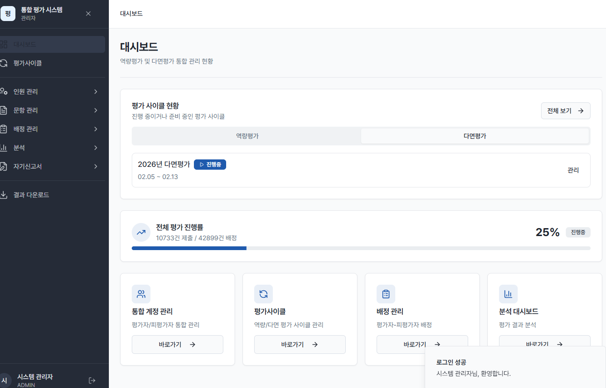
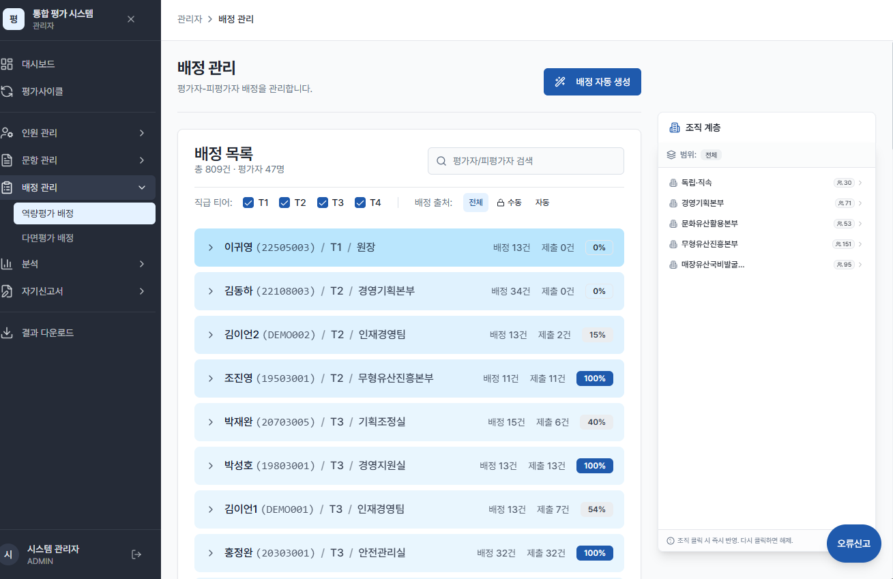
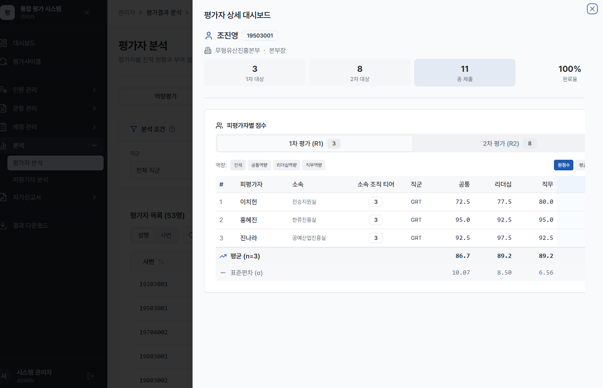
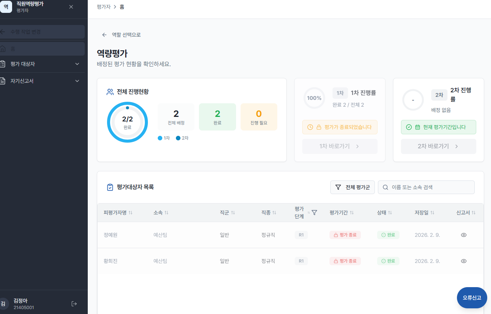
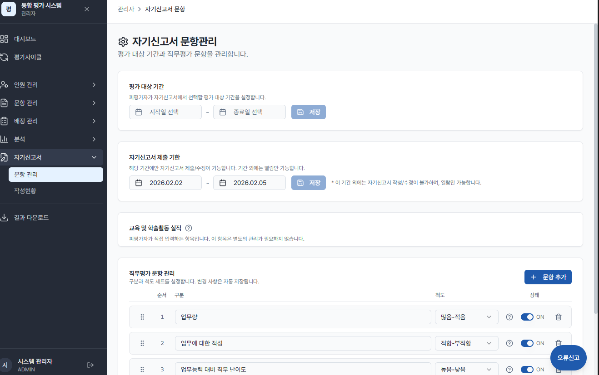
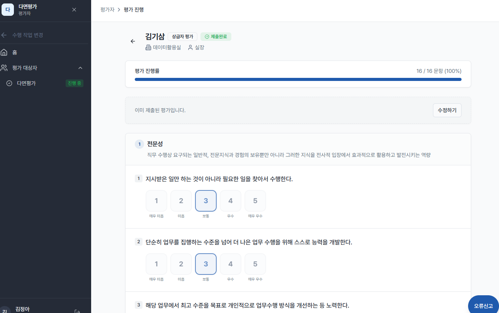

# portpolio
<!DOCTYPE html>
<html lang="en">
<head>
<meta charset="UTF-8">
<meta name="viewport" content="width=device-width, initial-scale=1.0">
<title>Daihn Kim — Deployment Strategist</title>
<meta name="description" content="Portfolio of Daihn Kim — Deployment Strategist who turns ambiguous business problems into working deployed systems.">
<link rel="preconnect" href="https://fonts.googleapis.com">
<link href="https://fonts.googleapis.com/css2?family=Inter:wght@400;500;600;700;800;900&display=swap" rel="stylesheet">

</head>
<body>

<!-- ════════════════════════════════════════════
     NAVIGATION
════════════════════════════════════════════ -->
<nav id="nav">
  

    

      <a href="#hero" class="nav-logo">DK.</a>
      

        <a href="#projects">Projects</a>
        <a href="#about">About</a>
        <a href="#contact">Contact</a>
        <a href="https://github.com/daihnkim" target="_blank" rel="noopener" class="nav-cta">GitHub →</a>
      

    

  

</nav>

<!-- ════════════════════════════════════════════
     HERO
════════════════════════════════════════════ -->
<section id="hero">
  

  

  

    

      
Deployment Strategist

      <h1 class="hero-name">Daihn <em>Kim</em>.</h1>
      
From customer pain to deployed solution — end to end.

      

        

          
3

          
Systems Deployed

        

        

          
₩4M

          
Monthly Savings

        

        

          
450+

          
Active Users Served

        

        

          
75%

          
Ops Time Reduced

        

      

      

        <a href="#projects" class="btn btn-primary">View Projects →</a>
        <a href="#contact" class="btn btn-ghost">Get in Touch</a>
      

    

  

  

    Scroll
    

  

</section>

<!-- ════════════════════════════════════════════
     ABOUT
════════════════════════════════════════════ -->
<section id="about" class="section">
  

    

      

        
About

        <h2>I connect business problems to working systems.</h2>
        
I specialize in translating ambiguous, real-world operational problems into deployed solutions — bridging the gap between non-technical stakeholders and technical execution.

        
My work spans the full delivery cycle: gathering requirements from business teams, designing system architecture, building data pipelines and custom UIs, and operating systems through post-launch.

        

          

Structuring ambiguous business requirements into technical specs

          

Designing human-in-the-loop workflows for non-technical operators

          

Connecting data pipelines to real operational workflows

          

Iterating based on user feedback through live operations

        

      

      

        
Technical Skills

        

          

            
Frontend

            

              ReactNext.js
              TypeScriptTailwind CSS
            

          

          

            
Backend & Data

            

              SupabasePostgreSQL
              PythonSQL
            

          

          

            
Deployment

            

              VercelGitHub Pages
              REST APISupabase Auth
            

          

          

            
Automation

            

              BrowserbasePDF Parsing
              Template EngineJob Queue
            

          

        

      

    

  

</section>

<!-- ════════════════════════════════════════════
     PROJECTS OVERVIEW
════════════════════════════════════════════ -->
<section id="projects" class="section">
  

    

      

        
Selected Work

        <h2>Projects</h2>
      

      
Three systems, each solving a real operational problem — from discovery to deployment.

    

    

      <a href="#proj-eval" class="proj-card reveal">
        
01 ／ Evaluation System

        <h3 class="proj-title">Integrated Performance Evaluation Platform</h3>
        
Dec 2025 – Jan 2026

        
Full-cycle performance management system for a 400-employee enterprise — automating competency reviews, 360° evaluations, and self-assessments with real-time admin oversight.

        

          
₩4,000,000

          
Monthly operational cost savings

        

        

          React / Next.js
          Supabase
          PostgreSQL
          Role-based Auth
        

        
View Case Study →

      </a>

      <a href="#proj-reminder" class="proj-card reveal" data-delay="1">
        
02 ／ Reminder Admin

        <h3 class="proj-title">Survey Reminder Automation Tool</h3>
        
Apr 2026 – May 2026

        
Admin tool to automate personalized reminder messages for 150 leadership survey participants. Solo-built from requirements gathering to production deployment.

        

          
8 hrs → 2 hrs

          
75% ops time reduction per campaign

        

        

          Next.js
          TypeScript
          Supabase
          Human-in-loop
        

        
View Case Study →

      </a>

      <a href="#proj-resume" class="proj-card reveal" data-delay="2">
        
03 ／ Job Search Automation

        <h3 class="proj-title">Resume & JD Matching Pipeline</h3>
        
May 2026 – Present

        
Personal automation pipeline for job applications: scrapes job postings, parses resumes from PDF, analyzes JD keyword fit, and surfaces bullet-level optimization suggestions.

        

          
In Progress

          
MVP live · keyword matching in development

        

        

          Python
          Flask
          Browserbase
          PDF Parsing
        

        
View Case Study →

      </a>
    

  

</section>

<!-- ════════════════════════════════════════════
     PROJECT 1 — EVALUATION SYSTEM
════════════════════════════════════════════ -->
<section id="proj-eval" class="proj-detail">
  

    <!-- Header -->
    

      
Project 01

      

        

          Timeline
          Dec 2025 – Jan 2026
        

        

          My Role
          System Design &amp; Development (under PM)
        

        

          Users
          ~400 employees · Enterprise HR client
        

        

          Status
          Deployed &amp; Post-op Complete
        

      

      <h2 class="pd-title">Integrated Performance Evaluation Platform</h2>
      
Transformed a manual, error-prone HR evaluation process into a centralized web platform — serving 400 employees across competency reviews, 360° evaluations, and self-assessments.

    

    <!-- Tabs -->
    

      
Overview

      
Architecture

      
Workflow

      
Impact

      
Screenshots

      
Tech Stack

    

    <!-- TAB: Overview -->
    

      

        

          <h4>🔴 The Problem</h4>
          
An enterprise HR client ran annual performance cycles for 400 employees using a mix of Excel and email — leading to critical bottlenecks:

          <ul>
            <li>Assignment errors from manual Excel mapping across 40+ departments</li>
            <li>No real-time visibility into evaluation progress — HR had to follow up individually</li>
            <li>Three separate tools for competency reviews, 360° evaluations, and self-assessments created data silos</li>
            <li>Post-evaluation result compilation took days of manual Excel consolidation</li>
          </ul>
        

        

          <h4>🟢 The Solution</h4>
          
A unified web platform consolidating all evaluation types under a single admin dashboard and participant portal:

          <ul>
            <li>One-click assignment engine: maps evaluators to targets by tier (T1–T4) automatically</li>
            <li>Live progress dashboard with per-employee and per-department drill-down</li>
            <li>Unified portal: competency review, 360°, and self-assessment in one system</li>
            <li>Structured Excel export for downstream HR analytics — ready in seconds</li>
          </ul>
        

      

      

        <h4>👤 My Role</h4>
        
Working under a PM, I owned the full technical delivery: requirements sessions with the HR team, translating business needs into system design, database schema, frontend UI for both admin and participant portals, API routes, and post-deployment operations support. I designed the assignment logic, data model for evaluation cycles, and the analytics views from scratch.

      

    

    <!-- TAB: Architecture -->
    

      

        

          
Business Input

          

            HR Requirements
            Employee Roster (400 users)
            Evaluation Criteria &amp; Question Bank
          

        

        
↓

        

          
Data Layer — Supabase / PostgreSQL

          

            Users &amp; Roles
            Evaluation Cycles
            Question Bank
            Assignment Matrix (42,899 records)
            Response Records
            Self-Assessment Data
          

        

        
↓

        

          
Application Layer — Next.js + React

          

            Admin Portal (cycle config, oversight)
            Evaluator Portal (personal tasks)
            Auto-Assignment Engine
            Real-time Progress Dashboard
            Analytics &amp; Score Viewer
            Excel Exporter
          

        

        
↓

        

          
User Roles

          

            HR Admin — cycle management, monitoring, export
            Manager — competency + 360° evaluations
            Employee — self-assessment
          

        

      

    

    <!-- TAB: Workflow -->
    

      

        

          
1

          

            <h4>Requirements Discovery</h4>
            
Sat with the HR team to map existing pain points, evaluation types, org hierarchy, and approval workflows. Translated business requirements into a system design spec before writing code.

          

        

        

          
2

          

            <h4>Cycle Configuration</h4>
            
HR admin creates an evaluation cycle, sets the date range, selects evaluation types, and uploads the employee roster with tier classifications (T1–T4). All in a guided UI flow.

          

        

        

          
3

          

            <h4>Automated Assignment Generation</h4>
            
The assignment engine reads tier data and automatically generates evaluator–target pairings per evaluation type. Manual overrides are available. Result: 42,899 assignments generated with zero mapping errors.

          

        

        

          
4

          

            <h4>Evaluation Period — Human-in-the-Loop</h4>
            
Evaluators access assigned targets through a personalized portal showing their tasks, deadlines, and submission status. The system surfaces stalled evaluations for HR escalation in real time.

          

        

        

          
5

          

            <h4>Admin Monitoring &amp; Live Dashboard</h4>
            
HR admin monitors overall progress %, department-level breakdown, and individual completion status. Filters and search enable targeted follow-up without any manual tracking spreadsheet.

          

        

        

          
6

          

            <h4>Result Export &amp; Post-Processing</h4>
            
Upon cycle close, results are aggregated and exported as structured Excel files for downstream analytics. Our team performed data integrity verification and post-operation checks — fully supported through the end of the cycle.

          

        

      

    

    <!-- TAB: Impact -->
    

      

        

          
₩4M

          
Monthly Cost Savings

          
Operational overhead eliminated

        

        

          
400

          
Employees Onboarded

          
On a single unified platform

        

        

          
42,899

          
Auto-Assigned Evaluations

          
Zero manual mapping errors

        

      

      

        

          
Before

          

            
✗ Assignment errors from manual Excel mapping across 40+ departments

            
✗ No real-time visibility into evaluation progress — constant manual follow-up

            
✗ Three separate tools created data silos between evaluation types

            
✗ Days of manual Excel work to compile post-cycle results

            
✗ High coordination overhead across 400 employees = ₩4M/month in labor cost

          

        

        

          
After

          

            
✓ One-click automated assignment — 42,899 records, zero errors

            
✓ Live dashboard: overall % + per-department + per-person breakdown

            
✓ All three evaluation types unified in one system and portal

            
✓ Structured Excel export in seconds — no post-processing required

            
✓ ₩4,000,000/month in operational savings

          

        

      

    

    <!-- TAB: Screenshots -->
    

      

        

          
          
Admin Dashboard — Evaluation cycle overview with live progress %

        

        

          
          
Assignment Management — Auto-generated pairings with tier labels (T1–T4)

        

        

          
          
Analytics Dashboard — Individual score breakdown by competency dimension

        

        

          
          
Evaluator Portal — Personalized view with 1st/2nd round progress tracking

        

        

          
          
User Management — Evaluator list with per-person submission status

        

        

          
          
Evaluation Form — Structured competency rating interface

        

      

    

    <!-- TAB: Tech Stack -->
    

      

        

React / Next.js

        

TypeScript

        

Supabase

        

PostgreSQL

        

Role-based Auth (Admin / Evaluator / Employee)

        

Excel Export (SheetJS)

        

Real-time subscriptions (Supabase Realtime)

        

Vercel

      

      

        <h4>Key Engineering Decisions</h4>
        <ul>
          <li><strong>Assignment as data, not logic</strong> — assignment matrix stored as database records, enabling real-time queries, overrides, and audit trails without rebuilding logic</li>
          <li><strong>Role-based portal separation</strong> — admin, evaluator, and employee views are distinct route trees, preventing confusion and UI complexity for non-technical users</li>
          <li><strong>Progress as a derived metric</strong> — progress % is computed from response records at query time, always reflecting the true state without a separate sync job</li>
          <li><strong>Export is a first-class feature</strong> — structured Excel output matching downstream HR tools was designed from day one, not bolted on</li>
        </ul>
      

    

  

</section>

<!-- ════════════════════════════════════════════
     PROJECT 2 — REMINDER ADMIN
════════════════════════════════════════════ -->
<section id="proj-reminder" class="proj-detail">
  

    

      
Project 02

      

        

          Timeline
          Apr 2026 – May 2026
        

        

          My Role
          Solo — Requirements to Production Deployment
        

        

          Scope
          150 leaders · 450 surveys
        

        

          Status
          Live &amp; Operating
        

      

      <h2 class="pd-title">Survey Reminder Automation Tool</h2>
      
I gathered requirements, designed the solution, and shipped a production admin tool — solo. Cut a manual 8-person-hour task down to 2 hours, with a human approval gate built in.

    

    

      
Overview

      
Architecture

      
Workflow

      
Impact

      
Implementation

    

    <!-- TAB: Overview -->
    

      

        

          <h4>🔴 The Problem</h4>
          
During a leadership 360° survey cycle, the ops team needed to send personalized reminders to 150 leaders. Each message required:

          <ul>
            <li>A unique leader name in the body</li>
            <li>A specific deadline date per cohort</li>
            <li>A unique survey URL per leader</li>
            <li>Consistent tone and brand formatting</li>
          </ul>
          
Previously: 4 people spent 8 hours manually composing from an Excel sheet. Error-prone, tedious, and unscalable.

        

        

          <h4>🟢 My Discovery Process</h4>
          
I ran a requirements session with the operations team to understand:

          <ul>
            <li>Which variables changed per recipient (name, deadline, link)</li>
            <li>What approval checkpoints they needed before mass-sending</li>
            <li>How they wanted to track send status and errors</li>
            <li>What "failure" looked like — and what would erode trust fastest</li>
          </ul>
          
The key insight: the team's biggest fear was sending the wrong message to 150 people at once. I designed an explicit human review gate before any batch send.

        

      

    

    <!-- TAB: Architecture -->
    

      

        

          
Input

          

            Recipient list (Supabase)
            Message template
            Variables: {LEADER_NAME} {DEADLINE_LABEL} {SURVEY_LINK}
          

        

        
↓

        

          
Admin Interface — Next.js

          

            Compose Form
            Real-time Preview Panel
            Recipient Manager
            Job Log Table
          

        

        
↓

        

          
Human-in-the-Loop Gate (designed from requirements)

          

            Preview rendered message → Operator approves → Batch send triggered
          

        

        
↓

        

          
Delivery &amp; Monitoring

          

            Variable interpolation per recipient
            Batch message dispatch
            Per-send status logging (success / failed)
            Error surfacing for retry
          

        

      

    

    <!-- TAB: Workflow -->
    

      

        

          
1

          

            <h4>Requirements Discovery</h4>
            
Mapped current pain points, message variables, and failure scenarios with the operations team. Translated directly into a feature spec — no code written until the workflow was agreed upon.

          

        

        

          
2

          

            <h4>Template Composition</h4>
            
Operator opens the compose form and writes a message using {LEADER_NAME}, {DEADLINE_LABEL}, and {SURVEY_LINK} placeholders. A real-time preview panel renders the actual message instantly as they type.

          

        

        

          
3

          

            <h4>Human Review Gate</h4>
            
Before any message is sent, the operator reviews the rendered output. This step — a direct response to the team's trust concerns — creates an explicit moment of human judgment before committing to 150 sends.

          

        

        

          
4

          

            <h4>Batch Send</h4>
            
On approval, the system iterates through all 450 survey assignments, interpolates variables per recipient, and dispatches personalized messages. Progress is displayed in real time.

          

        

        

          
5

          

            <h4>Log &amp; Error Review</h4>
            
All send attempts are logged with timestamp, job type, status (success / failed), and error message. Failed sends surface immediately — no silent failures, and any error is actionable.

          

        

      

    

    <!-- TAB: Impact -->
    

      

        

          
75%

          
Time Reduction

          
8 person-hours → 2 hours per campaign

        

        

          
150

          
Leaders Reached

          
Per survey campaign cycle

        

        

          
450

          
Surveys Managed

          
Upward, downward &amp; peer evaluations

        

      

      

        

          
Before

          

            
✗ 4 people × 2 hours each = 8 person-hours per campaign

            
✗ Manual copy-paste from Excel into message composer for 150 recipients

            
✗ No systematic send confirmation or error tracking

            
✗ Fatigue-driven errors — occasional wrong-name or wrong-link sends

          

        

        

          
After

          

            
✓ 1 operator · 2 hours · no manual composing required

            
✓ Template engine handles all variable interpolation automatically

            
✓ Full job log — status + error message per send

            
✓ Human review gate prevents batch send mistakes

          

        

      

    

    <!-- TAB: Implementation -->
    

      

        

          <h4>Key Design Decisions</h4>
          <ul>
            <li><strong>Real-time preview</strong> — the operator sees the rendered message as they type, making the template feel tangible and reducing errors before any send action</li>
            <li><strong>Explicit human gate</strong> — approval step required before batch dispatch; designed around the team's stated trust concern, not added as an afterthought</li>
            <li><strong>Job log as a product feature</strong> — all send attempts logged with full status; failures surface immediately and are designed to be actionable</li>
          </ul>
        

        

          <h4>What I Learned</h4>
          <ul>
            <li>The most valuable feature was the preview panel — automation without visibility doesn't build trust with non-technical operators</li>
            <li>Friction at the right moment (the review gate) increased adoption confidence significantly</li>
            <li>For ops teams that care about accountability, logging is a first-class product concern — not a debugging convenience</li>
          </ul>
        

      

      
Tech Stack

      

        

Next.js 14

        

TypeScript

        

Supabase (DB + Auth)

        

PostgreSQL

        

Custom template engine ({variable} interpolation)

        

Job Queue + Structured Logger

        

Vercel

      

    

  

</section>

<!-- ════════════════════════════════════════════
     PROJECT 3 — RESUME & JD AUTOMATION
════════════════════════════════════════════ -->
<section id="proj-resume" class="proj-detail">
  

    

      
Project 03

      

        

          Timeline
          May 2026 – Present
        

        

          My Role
          Solo — Design &amp; Development
        

        

          Type
          Personal / Technical Project
        

        

          Status
          In Progress — MVP Live
        

      

      <h2 class="pd-title">Resume &amp; Job Search Automation Pipeline</h2>
      
A personal end-to-end pipeline: scraping job postings with Browserbase, parsing my resume from PDF, and running keyword-level fit analysis against each JD — surfacing bullet-by-bullet optimization gaps.

    

    

      
Overview

      
Architecture

      
Workflow

      
Engineering Notes

    

    <!-- TAB: Overview -->
    

      

        

          <h4>🔴 The Problem</h4>
          
Resume tailoring for each JD is essential but slow and hard to scale:

          <ul>
            <li>30–60 min per application to read a JD and map keywords to resume bullets</li>
            <li>Easy to miss high-priority terms buried in lengthy requirements sections</li>
            <li>No systematic way to compare coverage across multiple applications</li>
            <li>Manual process doesn't scale when applying to 10+ roles simultaneously</li>
          </ul>
        

        

          <h4>🟢 Solution Design</h4>
          
A layered pipeline separating each concern:

          <ul>
            <li><strong>Collection</strong> — Browserbase scraper crawls job boards, extracts structured JD data into jobs.csv</li>
            <li><strong>Parsing</strong> — PDF resume parser extracts experience blocks and bullets with a raw-text fallback for failures</li>
            <li><strong>Analysis</strong> — Rule-based NLP extracts and scores JD keywords by section weight and frequency</li>
            <li><strong>Matching</strong> — Bullet-by-bullet coverage analysis flags missing high-priority keywords</li>
          </ul>
        

      

    

    <!-- TAB: Architecture -->
    

      

        

          
Collection Layer

          

            Browserbase SDK (headless browser)
            Job board scraper
            JD structuring → jobs.csv
          

        

        
↓

        

          
Resume Parsing Layer — Python

          

            pdfplumber (primary)
            pypdf (fallback)
            Manual paste (UI fallback)
            Section splitter
            Experience parser → resume.json
          

        

        
↓

        

          
Analysis Layer

          

            JD keyword extractor (rule-based NLP)
            Noun phrase extraction
            Section-weighted scoring (Requirements &gt; Preferred)
            Category tagging: Role / Skill / Responsibility
          

        

        
↓

        

          
Review UI — Flask + Vanilla JS

          

            Resume Studio editor (inline edit)
            JD input &amp; keyword category view
            Coverage % per bullet
            Missing keyword flags &amp; rewrite suggestions
          

        

      

    

    <!-- TAB: Workflow -->
    

      

        

          
1

          

            <h4>Job Collection (Automated)</h4>
            
Browserbase scraper runs against job boards. Extracts title, company, full JD text, and requirements. Saves structured output to jobs.csv — shareable and filterable.

          

        

        

          
2

          

            <h4>Resume Upload &amp; Parse</h4>
            
User uploads a PDF resume. Parser extracts work experience into structured blocks (company, title, dates, bullets). Failed sections are saved as raw text for manual correction. Target: 80% auto-parsed, 20% human-corrected in UI.

          

        

        

          
3

          

            <h4>JD Keyword Analysis</h4>
            
JD text is processed: noun phrases extracted, scored by frequency and section weight (Requirements section ranks highest), and categorized into Role / Skill / Responsibility. Top verbs extracted separately for bullet rewriting.

          

        

        

          
4

          

            <h4>Bullet-Level Coverage Matching</h4>
            
Each resume bullet is tokenized and matched against JD keywords. Coverage % is calculated. Missing high-priority keywords are surfaced per bullet with category and priority context.

          

        

        

          
5

          

            <h4>Human Review &amp; Rewrite (In Progress)</h4>
            
User reviews suggestions and edits bullets inline. Current MVP: template-based rewrite hints. Phase 2: optional LLM-assisted rewrites with explicit warnings and original preservation.

          

        

      

    

    <!-- TAB: Engineering Notes -->
    

      

        

          <h4>Architecture Principles</h4>
          <ul>
            <li><strong>Layered, independently testable</strong> — each stage (extract → parse → analyze → match) can be run and verified in isolation</li>
            <li><strong>Raw text preserved at every stage</strong> — parse failures are recoverable; never lose the original input</li>
            <li><strong>Deterministic base, optional LLM</strong> — rule-based is debuggable, trustworthy, and works offline; LLM is a later opt-in layer</li>
            <li><strong>Edit UI is first-class</strong> — 80% automation target means 20% lives in a good edit interface, not more parsing complexity</li>
          </ul>
        

        

          <h4>Key Takeaways (In Progress)</h4>
          <ul>
            <li>PDF parsing inconsistency is a product constraint to accept, not an engineering problem to "solve" indefinitely</li>
            <li>The most valuable feature is showing what's <em style="color:var(--accent)">missing</em>, not just what matches — the gap is what drives action</li>
            <li>Rewrite suggestions without user control are dangerous — always show what changed and preserve the original</li>
            <li>Job scraping and resume analysis share the same underlying need: clean, structured, comparable text</li>
          </ul>
        

      

      
Tech Stack

      

        

Python 3.12

        

Flask

        

pdfplumber + pypdf

        

Browserbase SDK

        

Rule-based NLP (custom)

        

HTML / CSS / Vanilla JS

        

JSON persistence (resume.json)

      

    

  

</section>

<!-- ════════════════════════════════════════════
     CONTACT
════════════════════════════════════════════ -->
<section id="contact" class="section">
  

    

      

        
Get In Touch

        <h2>Let's work together.</h2>
        
Open to Deployment Strategist, Forward Deployed Engineer, and Solutions Engineer roles. I bring the full cycle — from understanding a customer's problem to operating the solution in production.

      

      

        <a href="mailto:daihnkim@gmail.com" class="contact-link">
          ✉
          daihnkim@gmail.com
        </a>
        <a href="https://github.com/daihnkim-rgb/portpolio" target="_blank" rel="noopener" class="contact-link">
          ⌥
          github.com/daihnkim
        </a>
        <a href="https://www.linkedin.com/in/danny-kim-%EA%B9%80%EB%8B%A4%EC%9D%B8-9024a1260/" target="_blank" rel="noopener" class="contact-link">
          ▣
          linkedin.com/in/daihnkim
        </a>
      

    

  

</section>

<footer class="foot">
  

    

      © 2026 Daihn Kim · Built for deployment.
      <a href="#hero" class="foot-back">↑ Back to top</a>
    

  

</footer>

<!-- ════════════════════════════════════════════
     LIGHTBOX
════════════════════════════════════════════ -->

  <button class="lb-close" onclick="lbClose()">✕</button>
  
  

<!-- ════════════════════════════════════════════
     JAVASCRIPT
════════════════════════════════════════════ -->

</body>
</html>